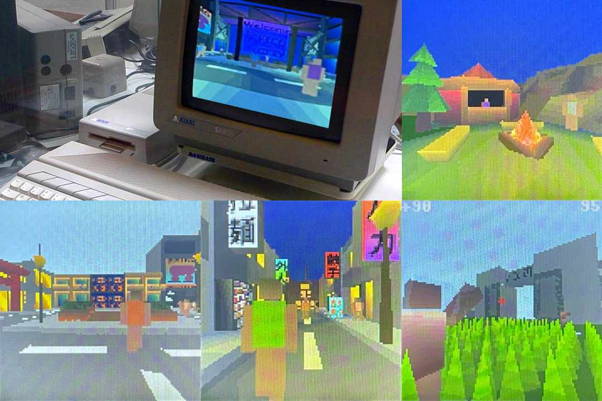

# Pico3D Open World 3D Game Engine for Atari ST with SidecarTridge Multi-device



Ported from [Pimoroni PicoSystem](https://github.com/bernhardstrobl/Pico3D) to Atari ST with [SidecarTridge Multi-device](https://store.sidecartridge.com) by [Neil Rackett](https://x.com/neilrackett)

## Overview

It loads, it runs, you can walk around, you can look up (and sometimes down again). If it breaks, just press SELECT-RESET and you're safely back to Booster.

It's still very much a work in progress, but you're more than welcome to give it a try!

This engine uses the second core of the RP2040 microcontroller inside the SidecarTridge Multi-device as a rasterizer to render 3D graphics at 160×100 (pixel-doubled to 320×200) in 16 colours on the Atari ST.

It contains a small city as well as city outskirts featuring a small shooter with zombies.

## Hardware Requirements

- [SidecarTridge Multi-device](https://store.sidecartridge.com) (RP2040-based ROM cartridge emulator)
- Atari ST, STE, MegaST, or MegaSTE in low-resolution mode (320×200, 16 colours)

## Installation

1. Download the latest files from the [releases page](https://github.com/neilrackett/md-pico3d/releases).
2. Copy the `.uf2` and `.json` files to the `/apps` folder of your SidecarT's microSD card.
3. On the Booster screen, press ESC for the app list and select the Pico3D app.

## Building from Source

### Prerequisites

- [Docker Desktop](https://www.docker.com/products/docker-desktop/) (for the ST 68000 assembler toolchain via `stcmd`)
- [ARM GNU Toolchain](https://developer.arm.com/downloads/-/arm-gnu-toolchain-downloads) for arm-none-eabi
- CMake 3.26+
- Python 3

### Build

```sh
./build.sh pico debug <uuid>
```

Replace `<uuid>` with the app UUID key. For example:

```sh
./build.sh pico debug 991d4c35-3d0d-4e90-8bff-f7f1f1f93483
```

This will:

1. Assemble the Atari ST 68000 firmware (`target/atarist/src/main.s`) via Docker
2. Convert it to a C header (`rp/src/include/target_firmware.h`)
3. Build the RP2040 firmware with CMake
4. Produce `dist/<uuid>-v<version>.uf2` and `dist/<uuid>.json`

The pico-sdk and pico-extras submodules are checked out automatically by the build script.

### Test Image Mode

`TEST_IMAGE_MODE` is a compile-time mode used to test the render pipeline by skipping gameplay and displays a static test image through the same ST output path (chunky RGB4444 → Bayer-dithered C2P → 320×200 planar + palette upload).

```sh
TEST_IMAGE_MODE=1 ./build.sh pico debug <uuid>
```

If you would like to update the image, run:

```sh
python3 tools/gen_test_mode_image.py \
  --input assets/test_mode.png \
  --output rp/src/include/test_mode_image.h
```

### Palette data

The 4 day/night colour palettes and RGB4444→index LUTs are pre-generated from the world geometry. To regenerate after modifying `chunk_data.c`:

```sh
python3 tools/gen_palette.py
```

This overwrites `rp/src/include/palette_data.h`.

## Blender Tutorials

- [Creating and exporting a game world in Blender](docs/tutorial_blender_export.md)
- [Material, lights and textures in Blender](docs/tutorial_blender_materials.md)
- [Exporting individual meshes](docs/tutorial_blender_mesh.md)

## F.A.Q.

### I don't have a SidecarTridge Multi-device?!

You can buy one from the [SidecarTridge store](https://store.sidecartridge.com)

### How did this project come about?

The original version of Pico3D was created as part of a master's thesis at the Kempten University of Applied Sciences (Hochschule Kempten).  
It was prototyped to answer the question of whether a modern $1 microcontroller could run a complete open world 3D game.
The thesis is available [here](https://lavarails.com/download/open_world_3D_microcontroller.pdf) and should answer most of the design decisions behind the engine.

### Will this run on a different microcontroller?

Daft-Freak has created a fork using the [32blit SDK](https://github.com/32blit/32blit-sdk) available [here](https://github.com/Daft-Freak/Pico3D).
It allows the engine to run on different 32blit enabled hardware including single-core STM32 systems and the RP2350.

### Where do I start as a developer?

Check out the Blender tutorials on creating your own game worlds.
[emul.c](rp/src/emul.c) contains the main loop. The most important function is `render_triangle()` in [engine/render_triangle.c](rp/src/engine/render_triangle.c), which transforms a triangle from world space and pushes it into the renderer.  
See the model headers under `rp/src/game/` and the `render_model_16bit()` functions for an example of adding your own meshes.  
The rasterizer (performance-critical) is in [engine/render_rasterize.c](rp/src/engine/render_rasterize.c).

### How big can the world be?

The included game has a grid size of 12×12 chunks (each chunk is 10×10m → world size of 120×120m).  
The chunk cache uses an 8-bit int per axis, limiting the world to 256×256 chunks (2.56×2.56km).

### How are the NPCs loaded in/out?

All 50 NPCs and 50 zombies are simulated simultaneously — this is cheap compared to rendering.  
Rendering is optimised with distance and view frustum culling.

### Game variants

- **Gamescom** (enabled with `-DGAMESCOM` compile flag) — replaces zombies with balloons.

### Why are there so many redundant functions in the zombie/NPC logic?

Divisions are relatively expensive on the RP2040 in quick succession.  
Keeping walk animation frame counts as powers of 2 lets the compiler use bit shifts instead. The redundancy avoids function call overhead in tight loops.
